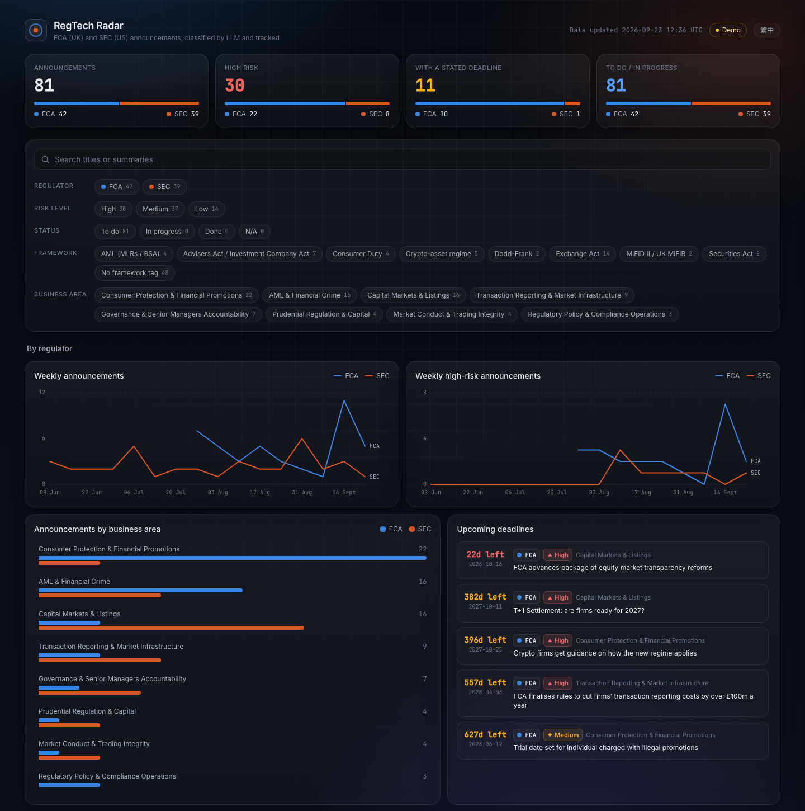

# RegTech Monitor

A small RegTech tool that watches the UK Financial Conduct Authority (FCA)'s public announcement feed, uses an LLM to classify each announcement by business impact and risk level, and surfaces the result in a filterable dashboard.

**[Live demo →](https://regtech-monitor-hbnkvuy6syr7hissuh5vm3.streamlit.app)** — kept current by the daily automation described below.



## Why this exists

Regulatory teams at financial institutions spend real hours every week manually scanning regulator news pages to figure out "does this new rule affect us, and how urgently." That triage step — read the announcement, decide who needs to know, decide how fast — is exactly the kind of repetitive judgment call an LLM is good at doing a first pass on.

The FCA is a well-documented, well-behaved place to prototype this idea: it publishes a public RSS feed, and — notably — the FCA itself has been opening up a structured Handbook API (as of August 2026) explicitly so that RegTech tooling like this can consume regulatory content programmatically. This project targets the *news/announcement* side (what changed, when), which is a natural complement to that Handbook API (what the current rules actually say).

This was built as a scoped, 4-week portfolio project — not a production compliance system. See [Scope & limitations](#scope--limitations) below.

## How it works

```
FCA RSS feed  ->  fetch article text  ->  LLM classification  ->  SQLite  ->  Streamlit dashboard
 (feedparser)      (requests + BS4)      (Gemini, swappable)     (dedup)      (filter + browse)
```

1. **Fetch** — pull the FCA's public RSS feed, then fetch and parse the full text of each linked announcement.
2. **Classify** — send the announcement to an LLM, which returns a structured JSON verdict: a 3-sentence summary, the affected business area, a risk level (high/medium/low), and a deadline if one is mentioned.
3. **Store** — persist to SQLite, keyed by URL, so re-running the pipeline never re-processes (or re-pays for) an announcement it's already seen.
4. **Browse** — a Streamlit dashboard reads the database and lets you filter by risk level and business area. The interface chrome (labels, headers, metrics) toggles between Chinese and English; the LLM-generated summaries and business-area tags themselves stay in the language they were classified in (Chinese).

## Tech stack

| Layer | Tool |
|---|---|
| Data source | FCA RSS feed |
| Fetching | `requests`, `feedparser`, `beautifulsoup4` |
| Classification | Gemini API (free tier), behind a provider-agnostic interface — see below |
| Storage | SQLite (`sqlite3`, no extra dependency) |
| Dashboard | `streamlit` |

### Design note: the LLM provider is a swappable detail, not a foundation

`pipeline.py` never calls Gemini directly — it only ever calls `summarize_announcement(title, text)` from `llm_client.py`. Switching providers (e.g. to Anthropic) is a one-line `.env` change (`LLM_PROVIDER=anthropic`) plus `pip install anthropic`; no other code changes. This project started on Gemini specifically because it has a genuinely free tier (no card required) suited to a side project's request volume — Anthropic's API is metered from the first call.

### Design note: errors are expected, not exceptional

Fetching live web content and parsing LLM output both fail sometimes — a page's markup changes, a request times out, the model wraps its JSON in a markdown code fence instead of returning raw JSON as instructed. The pipeline treats all of this as routine: one failed announcement is logged and skipped, never allowed to crash the batch. Transient server errors (503s) get a short exponential-backoff retry; malformed LLM output does not (retrying an LLM call rarely fixes a formatting quirk, and the JSON parser already strips the common code-fence case before giving up).

## Setup

```bash
git clone <this-repo>
cd regtech-monitor
python3 -m venv venv
source venv/bin/activate       # Windows: venv\Scripts\activate
pip install -r requirements.txt
```

Create a `.env` file (never committed — see `.gitignore`):

```
LLM_PROVIDER=gemini
GEMINI_API_KEY=your-key-here
```

Get a free Gemini API key at [aistudio.google.com/apikey](https://aistudio.google.com/apikey) — no credit card required.

## Running it

```bash
# 1. Fetch the latest RSS entries and preview the first article's extracted text
python3 fetch.py

# 2. Run the full pipeline: fetch -> classify -> store (skips anything already in the DB)
python3 pipeline.py

# 3. Launch the dashboard
streamlit run app.py
```

The dashboard opens automatically at `http://localhost:8501`.

## Automation (optional)

A GitHub Actions workflow (`.github/workflows/daily-pipeline.yml`) runs `pipeline.py` daily at 07:00 UTC and commits any newly-classified announcements straight back to `data/announcements.db`, so the dashboard stays current without anyone running it by hand. To enable it on your own fork:

1. In the repo's **Settings → Secrets and variables → Actions**, add a repository secret named `GEMINI_API_KEY` with your key.
2. In **Settings → Actions → General → Workflow permissions**, select "Read and write permissions" (the workflow needs to push its own commits).
3. It also runs on-demand from the **Actions** tab (`workflow_dispatch`) if you don't want to wait for the schedule.

## Project structure

```
regtech-monitor/
├── fetch.py          # RSS + article text extraction
├── llm_client.py      # LLM classification, provider-agnostic
├── pipeline.py        # batch fetch -> classify -> store, with dedup + error handling
├── app.py              # Streamlit dashboard
├── data/
│   └── announcements.db
├── docs/
│   └── dashboard-screenshot.png
├── .github/workflows/
│   └── daily-pipeline.yml  # optional: scheduled auto-run
└── requirements.txt
```

## Scope & limitations

- Runs on-demand (`python3 pipeline.py`), not on a schedule. Automating this via GitHub Actions is a natural next step but wasn't part of the initial 4-week build.
- Single data source (FCA RSS). No deduplication across sources, since there's only one.
- LLM classification is a first-pass triage aid, not a compliance judgment — a human should still read the actual announcement before acting on it, especially for anything flagged high risk.
- No automated tests. Correctness was verified manually at each stage against real FCA data (see the build log below).

## Build log

This project was built by following a written spec and course-correcting where reality (API availability, quota limits, LLM output quirks) diverged from the plan — with every deviation recorded rather than silently patched over. See [`PROJECT_SPEC.md`](PROJECT_SPEC.md) for the original spec plus a running changelog of what changed during implementation and why (model swaps forced by free-tier quota limits, a retry policy added after hitting transient 503s, a JSON parser hardened after catching an LLM occasionally wrapping its output in a markdown code fence).
